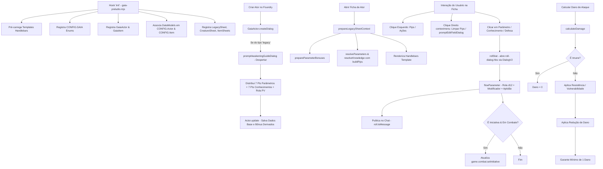

# Documentação do Sistema Gaia: Prelúdio

Este documento contém a especificação detalhada de todas as **Estruturas de Dados (Data Models)**, **Fluxo de Aplicação** e a **Lista Completa de Funções** (com nome e descrição) do sistema **Gaia: Prelúdio** para Foundry Virtual Tabletop (v14 / ApplicationV2).

---

## 1. Estruturas de Dados (Data Models)

O sistema utiliza a API nativa de `DataModel` do Foundry VTT (`foundry.abstract.TypeDataModel`) para validação rigorosa de schemas e estruturação dos documentos `Actor` e `Item`.

### 1.1. Modelos Base

#### `BaseDataModel` (`module/data/baseModel.mjs`)
*Extende `TypeDataModel`. Modelo raiz com propriedades comuns a todos os documentos.*
* **`name`** (`StringField`, Obrigatório): Nome da entidade.
* **`description`** (`StringField`, Opcional): Descrição textual ou notas.
* **`actions`** (`ArrayField<SchemaField>`, Inicial: `[]`): Lista de ações configuradas (ataques, habilidades ou feitiços).
  * `name` (`StringField`): Nome da ação.
  * `type` (`StringField`, Padrão: `"attack"`): Tipo da ação.
  * `attackFormula` (`StringField`): Fórmula de rolagem de ataque.
  * `damageFormula` (`StringField`): Fórmula de rolagem de dano.
  * `damageType` (`StringField`): Tipo de dano causado.
  * `saveAbility` (`StringField`): Parametro exigido na salvaguarda do alvo.
  * `saveDC` (`NumberField`, Inteiro, Mín: 0, Padrão: 10): Classe de Dificuldade da salvaguarda.

#### `AbilityBaseModel` (`module/data/abilitiesBaseModel.mjs`)
*Extende `BaseDataModel`. Modelo base para itens do tipo habilidade.*
* Campos herdados de `BaseDataModel` (`name`, `description`, `actions`).
* **`category`** (`StringField`, Padrão: `"other"`): Categoria da habilidade.
* **`cost`** (`StringField`): Custo de uso (ex: pontos de energia/ações).
* **`typeAction`** (`StringField`): Tipo de ação (ativa, rápida, acelerada, etc.).
* **`type`** (`StringField`): Classificação do tipo de habilidade.
* **`numberTarget`** (`NumberField`, Inteiro, Padrão: 1): Número de alvos afetados.
* **`range`** (`StringField`): Alcance da habilidade.
* **`Improvements`** (`ArrayField<StringField>`): Lista de aprimoramentos disponíveis/desbloqueados.

---

### 1.2. Modelos de Atores (Actor Data Models)

#### `ActorBaseDataModel` (`module/data/ActorBaseModel.mjs`)
*Extende `BaseDataModel`. Modelo base abstrato para todos os atores do sistema (Personagens, NPCs e Criaturas).*
* Campos herdados de `BaseDataModel` (`name`, `description`).
* **`nivel`** (`NumberField`, Inteiro, Mín: 0, Padrão: 1): Nível ou Nível de Desafio.
* **`health`** (`SchemaField`): Pontos de Vida (PV).
  * `value` (`NumberField`, Inteiro, Padrão: 30): PV atual.
  * `max` (`NumberField`, Inteiro, Mín: 0, Padrão: 30): PV máximo base.
  * `temp` (`NumberField`, Inteiro, Mín: 0, Padrão: 0): PV temporário.
* **`energy`** (`SchemaField`): Energia / Mana / Estamina.
  * `value` (`NumberField`, Inteiro, Mín: 0, Padrão: 5): Energia atual.
  * `max` (`NumberField`, Inteiro, Mín: 0, Padrão: 5): Energia máxima.
  * `temp` (`NumberField`, Inteiro, Mín: 0, Padrão: 0): Pontos de Energia Temporários (PET).
* **`death`** (`SchemaField`): Sistema de Dado de Morte para alvos Incapacitados.
  * `sentences` (`NumberField`, Inteiro, Mín: 0, Máx: 2, Padrão: 0): Sentenças do Corruptor acumuladas (2 = Morte).
  * `gifts` (`NumberField`, Inteiro, Mín: 0, Máx: 2, Padrão: 0): Dádivas do Artesão acumuladas (2 = Estabilizado).
  * `stabilized` (`BooleanField`, Padrão: false): Indicador se o alvo está estabilizado (não precisa rolar Dado de Morte e regenera 1d4 PV a cada 10 min).
* **`movement`** (`NumberField`, Inteiro, Mín: 0, Padrão: 6): Deslocamento base em m/quadrados.
* **`block`** (`NumberField`, Inteiro, Mín: 0, Padrão: 0): Valor defensivo de bloqueio base.
* **`passivePerception`** (`NumberField`, Inteiro, Padrão: 6): Percepção passiva base.
* **`inventario`** (`ArrayField<StringField>`): Referências/IDs de itens no inventário.
* **`damageResistance`** (`ArrayField<SchemaField>`): Resistências a danos.
  * `type` (`StringField`): Tipo de dano resistente.
* **`damageReduction`** (`ArrayField<SchemaField>`): Reduções fixas de dano.
  * `type` (`StringField`): Tipo de dano reduzido.
  * `value` (`NumberField`, Inteiro, Padrão: 0): Valor numérico da redução.
* **`damageImmunity`** (`ArrayField<SchemaField>`): Imunidades totais a dano.
  * `type` (`StringField`): Tipo de dano imune.
* **`damageVulnerability`** (`ArrayField<SchemaField>`): Vulnerabilidades a dano (dano dobrado).
  * `type` (`StringField`): Tipo de dano vulnerável.
* **`notes`** (`StringField`): Anotações e biografia do ator.
* **`parametersBonus`** (`ArrayField<SchemaField>`): Bônus temporários ou derivados aplicados a atributos.
  * `attr` (`StringField`): Caminho do atributo (ex: `"health.max"`, `"movement"`, `"passivePerception"`).
  * `bonus` (`NumberField`, Inteiro, Padrão: 0): Valor do bônus adicionado.

#### `LegacyDataModel` (`module/data/Legacy.mjs`)
*Extende `ActorBaseDataModel`. Modelo para personagens jogáveis (Legados).*
* Campos herdados de `ActorBaseDataModel`.
* **`legacy`** (`StringField`): Identificador do Legado/Arquétipo do personagem.
* **`exhaustion`** (`NumberField`, Inteiro, Mín: 0, Máx: 6, Padrão: 0): Nível de exaustão (0 a 6 pips).
  * **Regra de Exaustão:** Para cada 1 ponto de Exaustão, o personagem recebe **-1 de penalidade** em todos os testes de **Parâmetro** e **Bloqueio** realizados, e tem sua **Movimentação reduzida em 1 metro** por ponto. Ao atingir **6 pontos de Exaustão**, o personagem **morre**.
* **`parameters`** (`ArrayField<SchemaField>`): Lista dos 8 Parâmetros base.
  * `name` (`StringField`): Nome da chave do parâmetro (`precision`, `brutality`, `dexterity`, `agility`, `channeling`, `arcane`, `spirit`, `vigor`).
  * `value` (`NumberField`, Inteiro, Padrão: 0): Pontos no parâmetro (0 a 6).
* **`knowledge`** (`ArrayField<SchemaField>`): Lista dos 14 Conhecimentos (perícias).
  * `name` (`StringField`): Nome da chave do conhecimento (`charisma`, `mystic_knowledge`, `exploration`, `stealth`, `history`, `intimidation`, `intuition`, `medicine`, `perception`, `performance`, `religion`, `survival`, `technology`, `willpower`).
  * `value` (`NumberField`, Inteiro, Padrão: 0): Pontos no conhecimento (0 a 6).
* **`masteries`** (`ArrayField<StringField>`): Chaves das maestrias desbloqueadas.
* **`languages`** (`ArrayField<StringField>`): Idiomas conhecidos.
* **`appearance`** (`StringField`): Descrição visual e características físicas do Legado.
* **`height`** (`StringField`): Faixa ou altura média.
* **`lifeExpectancy`** (`StringField`): Expectativa de vida em anos ou eras.
* **`legacyAbilities`** (`ArrayField<SchemaField>`): Lista de Habilidades de Legado.
  * `name` (`StringField`): Nome da Habilidade.
  * `description` (`StringField`): Descrição textual.
  * `activeEffect` (`StringField`): Efeito ativo associado.

#### `LegacyNPCDataModel` / `LegacyNpcDataModel` (`module/data/Legacy.mjs`)
*Extende `LegacyDataModel`. Modelo para NPCs importantes baseados em Legado.*
* Campos herdados de `LegacyDataModel`.
* **`difficulty`** (`StringField`): Nível de dificuldade/desafio do NPC.
* **`powerPoints`** (`NumberField`, Inteiro, Padrão: 0): Pontos de poder do NPC.
* **`offensiveParameters`** (`NumberField`, Inteiro, Padrão: 0): Modificador ofensivo geral.
* **`defensiveParameters`** (`NumberField`, Inteiro, Padrão: 0): Modificador defensivo geral.

#### `CreatureDataModel` (`module/data/creature.mjs`)
*Extende `ActorBaseDataModel`. Modelo para monstros, feras e criaturas.*
* Campos herdados de `ActorBaseDataModel`.
* **`difficulty`** (`StringField`): Classificação de dificuldade (comum, elite, chefe, etc.).
* **`offensiveParameters`** (`NumberField`, Inteiro, Padrão: 0): Poder de ataque/parâmetro ofensivo.
* **`defensiveParameters`** (`NumberField`, Inteiro, Padrão: 0): Poder de defesa/parâmetro defensivo.
* **`brutal`** (`NumberField`, Inteiro, Padrão: 0): Modificador de força bruta/ataques físicos.
* **`mysticalEvocation`** (`NumberField`, Inteiro, Padrão: 0): Poder mágico/arcano inato.
* **`monsterBooks`** (`ArrayField<StringField>`): Fontes/referências em compêndios de monstros.
* **`skills`** (`ArrayField<StringField>`): Lista de habilidades e traços especiais da criatura.

---

### 1.3. Modelos de Equipamento (Item Data Models)

#### `EquipmentBaseDataModel` (`module/data/EquipmentModel.mjs`)
*Extende `TypeDataModel`. Modelo base para todos os itens inventariáveis.*
* **`name`** (`StringField`, Obrigatório): Nome do item.
* **`description`** (`StringField`, Opcional): Descrição detalhada.
* **`price`** (`NumberField`, Inteiro, Mín: 0, Padrão: 0): Custo em moedas.
* **`category`** (`StringField`, Padrão: `"other"`): Categoria do equipamento (`weapon`, `armor`, `shield`, `common`, `utilitarian`, `potion`, `toxic`, `vehicle`, `vestuary`, `rides`).
* **`unity`** (`NumberField`, Mín: 0, Padrão: 1): Espaço/peso ocupado.
* **`equipped`** (`BooleanField`, Padrão: `false`): Indica se o item está atualmente equipado.
* **`quantity`** (`NumberField`, Inteiro, Mín: 1, Padrão: 1): Quantidade acumulada no inventário.

#### `ArmorDataModel` (`module/data/EquipmentModel.mjs`)
*Extende `EquipmentBaseDataModel`. Modelo para armaduras, escudos e vestimentas de proteção.*
* Campos herdados de `EquipmentBaseDataModel`.
* **`block`** (`NumberField`, Inteiro, Mín: 0, Padrão: 0): Bônus de defesa / bloqueio concedido pela armadura.

#### `WeaponDataModel` (`module/data/EquipmentModel.mjs`)
*Extende `EquipmentBaseDataModel`. Modelo para armas e instrumentos de combate.*
* Campos herdados de `EquipmentBaseDataModel`.
* **`weaponType`** (`StringField`, Padrão: `"light"`): Tipo de arma (`light`, `medium`, `heavy`, `ranged`, `magical`).
* **`damageType`** (`SchemaField`): Informações do dano provido pela arma.
  * `value` (`NumberField`, Inteiro, Mín: 0, Padrão: 1): Quantidade/dado de dano base.
  * `type` (`StringField`, Padrão: `"slashing"`): Tipo de dano (`physical`, `fire`, `wind`, `water`, `earth`, `thunder`, `ice`, `neutro`, `nature`, `profane`, `light`, `dark`, `immaterial`).
* **`attackParameter`** (`SchemaField`): Parametro utilizado para a rolagem de ataque.
  * `value` (`NumberField`, Inteiro, Padrão: 0): Bônus adicional.
  * `attribute` (`StringField`, Padrão: `"precision"`): Parametro base de ataque.
* **`range`** (`SchemaField`): Alcance da arma.
  * `value` (`NumberField`, Inteiro, Mín: 0, Padrão: 1): Distância máxima.
  * `type` (`StringField`, Padrão: `"melee"`): Categoria de alcance (`melee` ou `ranged`).
* **`properties`** (`ArrayField<StringField>`): Propriedades especiais (ex: versátil, pesada, arremesso).

#### `RelicDataModel` (`module/data/RelicModel.mjs`)
*Extende `EquipmentBaseDataModel`. Modelo para Relíquias: itens e equipamentos únicos com habilidades e força de Véu.*
* Campos herdados de `EquipmentBaseDataModel` (`name`, `description`, `price`, `unity`, `equipped`, `quantity`, `actions`).
* **`category`** (`StringField`, Padrão: `"comum"`): Categoria da Relíquia (`comum`, `incomum`, `rara`, `lendaria`).
* **`potency`** (`NumberField`, Inteiro, Mín: 0, Máx: 3, Padrão: 0): Pontos de Potência de Véu armazenada na Relíquia.
  * **Comum:** 0 Potência
  * **Incomum:** 1 Potência
  * **Rara:** 2 Potência
  * **Lendária:** 3 Potência
* **`isBound`** (`BooleanField`, Padrão: `false`): Indica se a Relíquia está Vinculada ao personagem.
* **`properties`** (`StringField`): Notas, propriedades ou palavras-chave especiais da Relíquia.
* **Regra de Vínculo e Sobrecarga de Potência (Véu):**
  * Um personagem pode manter até **5 pontos de Potência** vindos de Relíquias Vinculadas.
  * Caso possua **mais de 5 pontos de Potência**, a cada minuto o personagem perde **1d20 Pontos de Vida (PV)** e **1d6 Pontos de Energia (PE)**.

---

## 2. Fluxo da Aplicação (Application Architecture & Flow)

### 2.1. Ciclo de Inicialização (`init` hook)
1. **Carregamento de Partiais Handlebars**: Carrega `actor-header.hbs`, `actor-personagem.hbs` e `inventory.hbs`.
2. **Configuração Global**: Injeta o objeto `GAIA` em `CONFIG.GAIA`.
3. **Mapeamento de Data Models**: Vincula `LegacyDataModel`, `LegacyNpcDataModel` e `CreatureDataModel` aos tipos de ator, e os modelos de equipamentos ao `CONFIG.Item.dataModels`.
4. **Registro de Fichas (ApplicationV2)**: Desregistra as fichas nativas e registra `CharacterLegacySheet`, `CreatureSheet`, `LegacyNpcSheet`, `EquipmentSheet`, `ArmorSheet`, `WeaponSheet`, `AbilitySheet`, `FeatureSheet`, `LegacySheet`, `PathSheet` e `RelicSheet`.
5. **Tipos de Itens Especiais**:
   * **Habilidade (`ability`)**: Poderes e técnicas com custo, tipo de ação, tipos, alvos, alcance, aprimoramentos, sub-efeitos e campo opcional de **Requerimento** (`system.requirement`).
   * **Característica (`feature`)**: Herda integralmente de Habilidade, adicionando categorias exclusivas como **Presença**, **Cólera**, **Redução**, **Passiva** e **Geral**.

### 2.2. Fluxo de Criação de Atores e Guia de Despertar
1. O usuário clica em "Criar Ator". O método estático `GaiaActor.createDialog()` intercepta a ação e exibe uma modal com os tipos customizados (`legacy`, `creature`, `legacyNpc`).
2. Se o tipo selecionado for `legacy`, dispara automaticamente o Wizard de Despertar / Criação (`promptAwakeningGuideDialog`).
3. O Guia permite alternar entre **Desperto (Nível 1)** e **Não-Desperto (Nível 0)**:
   * **Modo Desperto (Nível 1)**:
     * **Aba 1 (Parâmetros)**: Distribuição de 7 pontos entre os 8 parâmetros (máximo 2 por atributo).
     * **Aba 2 (Conhecimentos)**: Distribuição de 7 pontos entre os 14 conhecimentos (máximo 2 por perícia).
     * **Aba 3 (Recursos & Idiomas)**: PV base (30 + 1d6 ou 3 fixo + Vigor), 5 PE Máx, Deslocamento base 6m (+ bônus de Agilidade / 2).
   * **Modo Não-Desperto (Nível 0)**:
     * Mantém apenas Habilidades de Legado naturais.
     * **Aba 1 (Parâmetros)**: Distribuição de 4 pontos entre os parâmetros (máximo 2 por atributo).
     * **Aba 2 (Conhecimentos)**: Distribuição de 7 pontos entre os conhecimentos (máximo 2 por perícia).
     * **Aba 3 (Recursos & Idiomas)**: 12 PV fixos, 0 PE, Movimentação de 6 metros, Idioma Comum + 1 Idioma adicional à escolha.
4. Ao confirmar, o ator salva os atributos, recalcula os bônus derivados e atualiza o documento.

### 2.3. Fluxo de Atualização de Dados e Prevenção de Loop de Bônus (`_preUpdate` & `prepareDerivedData`)
1. **`prepareDerivedData`**:
   * Invoca `prepareParameterBonuses()`, que calcula a soma dos bônus dinâmicos em `parametersBonus` (ex: Agilidade adicionando bônus ao Deslocamento) e injeta em `actor.system.bonusesCalculated`.
   * Sanitiza os recursos atuais com `_prepareCharacterData()` usando `Math.clamp`.
2. **`_preUpdate`**:
   * Intercepta salvamentos da ficha. Se a alteração envolve um campo que possui bônus calculado, o método remove a parcela do bônus antes de persistir o valor no banco de dados, garantindo que salvar a ficha não dobre os bônus acumulativamente.

### 2.4. Fluxo de Rolagem de Dados (`rollStat` & `flow.mjs`)
1. **Disparo da Ação**: O jogador clica no nome ou valor de uma estatística na ficha.
2. **Atalhos de Teclado**:
   * Clique simples: Aptidão padrão (`standard` - 1d12).
   * `Shift + Clique`: Vantagem (`advantage` - 2d12kh).
   * `Alt + Clique` ou `Ctrl + Clique`: Desvantagem (`disadvantage` - 2d12kl).
3. **Diálogo de Rolagem (`DialogV2`)**: Renderiza a janela com opções de fórmula, modificador numérico e modo de mensagem no chat.
4. **Avaliação da Rolagem (`flowParameter`)**: Instancia a classe `Roll` com a fórmula correspondente (`1d12`, `2d12kh`, `2d12kl`, `3d12kh`, `3d12kl`) adicionando `@parameter + @modifier`.
5. **Combate & Iniciativa**: Se o tipo de rolagem for `initiative`, o resultado da rolagem é automaticamente enviado para a entrada correspondente no Combat Tracker (`game.combat.setInitiative`).

### 2.5. Fluxo de Cálculo de Dano e Defesa (`calculateDamage`)
O cálculo de dano é executado pela função `calculateDamage(damage, target)` seguindo esta ordem rigorosa de regras:
1. **Verificação de Imunidade**: Se `target.system.damageImmunity` contiver o tipo de dano (ou `"all"`), o dano final é reduzido para **0** imediatamente.
2. **Resistência vs Vulnerabilidade**:
   * Se possuir apenas Resistência, o dano é dividido por 2 (`Math.ceil`).
   * Se possuir apenas Vulnerabilidade, o dano é multiplicado por 2.
   * Se possuir ambas para o mesmo tipo de dano, elas se cancelam mutuamente.
3. **Redução de Dano**: Subtrai o valor acumulado de `damageReduction` aplicável.
4. **Dano Mínimo**: Se o dano resultante for menor que 1 (e o alvo não for imune), o dano final é fixado em **1**.

### 2.6. Fluxo do Navegador de Itens (`GaiaItemBrowser`)
O Navegador de Itens (`module/applications/item-browser.mjs`) permite buscar, filtrar e importar itens de forma centralizada:
1. **Varredura**: Indexa todos os itens criados no mundo (`game.items`) e todos os Compêndios do tipo `Item` (`game.packs`).
2. **Filtros em Tempo Real**:
   * **Busca Textual**: Filtra por nome ou texto da descrição.
   * **Tipo de Item**: Filtra por *Armamento*, *Armadura*, *Equipamento*, *Habilidade*, *Legado* ou *Todos*.
   * **Origem**: Filtra por *Mundo* ou por compêndios específicos.
3. **Ações**:
   * **Visualizar (`previewItem`)**: Abre a ficha original do item (`item.sheet.render(true)`).
   * **Adicionar (`importItem`)**: Adiciona o item selecionado à ficha do ator ativo (`actor.createEmbeddedDocuments("Item", [itemData])`).

---

## 3. Catálogo Completo de Funções por Módulo

### 3.1. Entry Point (`module/gaia-preludio.mjs`)

| Função / Listener | Assinatura | Descrição |
| :--- | :--- | :--- |
| **Hook `init`** | `Hooks.once("init", async () => ...)` | Inicializa o sistema, pré-carrega templates parciais do Handlebars, registra enums em `CONFIG.GAIA`, registra as classes `GaiaActor`/`GaiaItem`, atribui os `DataModels` e cadastra as fichas de ator e item em `Actors` e `Items`. |

---

### 3.2. Documento de Ator (`module/documents/actor.mjs` - Class `GaiaActor`)

| Função | Assinatura | Descrição |
| :--- | :--- | :--- |
| **`prepareBaseData()`** | `prepareBaseData(): void` | Executa a preparação inicial de dados do ator antes da leitura de itens e efeitos ativos. |
| **`_preUpdate()`** | `_preUpdate(changed, options, user): void` | Intercepta alterações prestes a serem salvas no banco. Remove bônus calculados para evitar persistência de valores inflados no banco. |
| **`prepareDerivedData()`** | `prepareDerivedData(): void` | Calcula os bônus de parâmetros derivados (`prepareParameterBonuses`), sanitiza limites de vida e energia e exibe log estruturado no console. |
| **`_prepareCharacterData()`** | `_prepareCharacterData(system): void` | Garante que os recursos de vida (`health`) e energia (`energy`) permaneçam dentro dos limites de 0 até o valor máximo. |
| **`getRollData()`** | `getRollData(): Record<string, any>` | Mapeia os parâmetros e conhecimentos para variáveis acessíveis em fórmulas de rolagem (ex: `@params.brutality`, `@knowledge.stealth`). |
| **`createDialog()`** *(estática)* | `static async createDialog(data, options): Promise<Actor\|null>` | Sobrescreve a modal de criação de atores padrão do Foundry, exibindo seleção customizada de tipo (`legacy`, `creature`, `legacyNpc`) e abrindo o Guia de Despertar se for Legado. |

---

### 3.3. Documento de Item (`module/documents/item.mjs` - Class `GaiaItem`)

| Função | Assinatura | Descrição |
| :--- | :--- | :--- |
| **`prepareDerivedData()`** | `prepareDerivedData(): void` | Prepara dados derivados específicos do item. |
| **`getRollData()`** | `getRollData(): Record<string, any>` | Retorna os dados do item fundidos com o contexto do ator pai (caso o item esteja no inventário de um ator). |
| **`roll()`** | `async roll(options): Promise<ChatMessage\|void>` | Rola/exibe a informação do item criando um cartão com nome e descrição no chat público. |

---

### 3.4. Auxiliares de Contexto de Ator (`module/helpers/actor-context.mjs`)

| Função | Assinatura | Descrição |
| :--- | :--- | :--- |
| **`buildPips()`** | `buildPips(value, max = 6): Array<{value: number, active: boolean}>` | Constrói uma lista de pips/diamantes marcando o estado ativo/inativo para renderização em templates. |
| **`resolveParameters()`** | `resolveParameters(system): { all: Array<{key, label, value, pips}> }` | Resolve os 8 Parâmetros base do ator com rótulos traduzidos e pips de 1 a 6. |
| **`resolveKnowledge()`** | `resolveKnowledge(system): { all: Array<{key, label, value, pips}> }` | Resolve os 14 Conhecimentos base do ator com rótulos traduzidos e pips de 1 a 6. |
| **`resolveMasteries()`** | `resolveMasteries(system): Array<{key: string, label: string}>` | Resgata a lista de maestrias ativas no ator com os nomes traduzidos. |
| **`resolveEquippedWeapons()`** | `resolveEquippedWeapons(actor): Array<{id, name, img, damage, range, properties}>` | Filtra e formata as armas equipadas no inventário do ator para exibição direta na tabela da ficha. |
| **`prepareParameterBonuses()`** | `prepareParameterBonuses(actor): Record<string, {original, bonus, total}>` | Lê a lista `parametersBonus`, soma aos atributos originais do ator e armazena os resultados calculados. |
| **`getAttrTooltip()`** | `getAttrTooltip(actor, attrPath, label): string` | Monta a string de dica (tooltip) detalhando Base, Bônus e Valor Total de um atributo. |
| **`prepareLegacySheetContext()`** | `async prepareLegacySheetContext(sheet, context): Promise<object>` | Prepara e enriquece todo o objeto de contexto consumido pela ficha Handlebars do Legado (`LegacySheet`). |

---

### 3.5. Auxiliares de Diálogos (`module/helpers/dialogs/index.mjs`)

| Função | Assinatura | Descrição |
| :--- | :--- | :--- |
| **`getDamageTypeOptions()`** | `getDamageTypeOptions(): Array<{key: string, label: string}>` | Retorna a lista plana de tipos de dano do sistema com seus rótulos i18n traduzidos. |
| **`promptDefenseTraitDialog()`** | `async promptDefenseTraitDialog(title, isReduction): Promise<{type, value?}\|null>` | Exibe uma modal `DialogV2` para cadastro de novas resistências, imunidades ou reduções de dano. |
| **`promptMasteryDialog()`** | `async promptMasteryDialog(actor): Promise<void>` | Abre um diálogo agrupado por conhecimentos para o jogador desbloquear uma nova maestria. |
| **`promptEditFieldDialog()`** | `async promptEditFieldDialog(actor, field, options): Promise<any\|null>` | Exibe diálogo genérico `DialogV2` para alteração interativa de qualquer campo numérico ou textual do ator. |
| **`promptAwakeningGuideDialog()`** | `async promptAwakeningGuideDialog(actor): Promise<any>` | Exibe a janela com abas do Guia de Despertar Inicial (distribuição de pontos em parâmetros, conhecimentos e definição de PV). |
| **`promptRollRequestDialog()`** | `async promptRollRequestDialog(): Promise<ChatMessage\|null>` | Exibe janela DialogV2 para o Narrador criar um Pedido de Teste (categoria, atributo, Dificuldade e notas) e postar botão interativo no Chat. |

---

### 3.6. Regras de Fluxo e Rolagem (`module/helpers/flow.mjs`)

| Função | Assinatura | Descrição |
| :--- | :--- | :--- |
| **`flowRoll()`** | `async flowRoll(formula, data, options): Promise<Roll>` | Instancia e avalia assincronamente uma fórmula de rolagem de dados (`Roll`). |
| **`flowParameter()`** | `async flowParameter(parameter, fitness, modifier): Promise<Roll>` | Executa a rolagem de um parâmetro aplicante o tipo de dado d12 (aptidão selecionada) e modificadores. |
| **`flowDamage()`** | `async flowDamage(damage): Promise<Roll>` | Executa a rolagem de uma fórmula de dano. |
| **`amplifyRoll()`** | `amplifyRoll(roll, energyPoints): number` | Adiciona pontos de energia/amplificação ao total numérico de uma rolagem. |
| **`maxRoll()`** | `async maxRoll(formula, data): Promise<Roll>` | Avalia uma rolagem com valor máximo maximizado. |
| **`minRoll()`** | `async minRoll(formula, data): Promise<Roll>` | Avalia uma rolagem com valor mínimo minimizado. |
| **`defense()`** | `async defense(type, actor, fitness): Promise<Roll>` | Executa um teste de defesa do ator (teste de Agilidade para esquiva ou Bloqueio para armaduras/escudos). |
| **`calculateDamage()`** | `calculateDamage(damage, target): number` | Executa a lógica de redução, imunidade, resistência e vulnerabilidade de dano no alvo. |
| **`modifyDieCategory()`** | `modifyDieCategory(dieOrFormula, steps): string\|number` | Aumenta ou reduz a categoria de um dado ou fórmula seguindo a escala: d4 -> d6 -> d8 -> d10 -> d12 -> d20. |
| **`isCriticalHit()`** | `isCriticalHit(attack, defense, options): object` | Valida se a diferença entre o ataque (Precisão/Canalização) e a Defesa do alvo é >= 10, retornando se foi Acerto Crítico. |
| **`flowClash()` / `flowEmbate()`** | `flowClash(roll1, roll2): object` | Executa a comparação de um Embate entre dois Alvos, retornando o vencedor (1, 2 ou 0 em empate) e a diferença. |
| **`flowDifficultyCheck()` / `flowTesteDificuldade()`** | `flowDifficultyCheck(roll, difficulty): object` | Valida se o resultado total de um teste atinge ou supera a Dificuldade (Dif.) estabelecida. |
| **`flowDestinyCheck()` / `flowTesteDestino()`** | `async flowDestinyCheck(difficulty, options): Promise<object>` | Rola um 1d12 puro (sem modificadores) e compara o resultado com a Dificuldade (Dif.) pré-estabelecida. |
| **`flowDeathDie()` / `flowDadoDeMorte()`** | `async flowDeathDie(actor, options): Promise<object\|null>` | Rola o Dado de Morte (1d12) para um alvo incapacitado: 1-6 concede Sentença do Corruptor (2 = Morte), 7-12 concede Dádiva do Artesão (2 = Estabilizado). |
| **`flowRegenerateStabilized()` / `flowRegenerarEstabilizado()`** | `async flowRegenerateStabilized(actor): Promise<Roll\|null>` | Rola 1d4 PV de regeneração a cada 10 minutos para um alvo estabilizado. |

---

### 3.7. Auxiliares de Rolagem de Estatísticas (`module/helpers/stat-rolls.mjs`)

| Função | Assinatura | Descrição |
| :--- | :--- | :--- |
| **`getStatEntry()`** | `getStatEntry(system, category, key): { value: number, label: string }` | Resgata o valor numérico e o rótulo traduzido de um parâmetro ou conhecimento do ator. |
| **`rollStat()`** | `async rollStat(actor, options): Promise<Roll\|null>` | Configura e executa a caixa de diálogo assíncrona de rolagem (`DialogV2`), gera o cartão no Chat e atualiza a iniciativa do combate se aplicável. |

---

### 3.8. Ficha do Legado (`module/applications/sheets/actor/legacy.mjs` - Class `LegacySheet`)

*Extende `HandlebarsApplicationMixin(ActorSheetV2)`.*

| Função / Action Handler | Assinatura | Descrição |
| :--- | :--- | :--- |
| **`_onRender()`** | `_onRender(context, options): void` | Configura listeners globais do DOM na ficha, incluindo detecção de clique direito (`contextmenu`) para edição rápida de campos e limpeza de pips. |
| **`_prepareContext()`** | `async _prepareContext(options): Promise<object>` | Invoca `prepareLegacySheetContext` para fornecer o contexto Handlebars completo para a ficha. |
| **`#onSetExhaustion`** *(privada)* | `static async #onSetExhaustion(event, target): Promise<void>` | Atualiza o número de pips de exaustão do personagem (0 a 6). |
| **`#onSetParameterPip`** *(privada)* | `static async #onSetParameterPip(event, target): Promise<void>` | Define o valor de um Parâmetro (1 a 6) ao clicar no diamante e recalcula bônus em Agilidade ou Vigor. |
| **`#onClearParameterPip`** *(privada)*| `static async #onClearParameterPip(event, target): Promise<void>` | Zera o valor de um Parâmetro via clique direito no elemento. |
| **`#onSetKnowledgePip`** *(privada)* | `static async #onSetKnowledgePip(event, target): Promise<void>` | Define o valor de um Conhecimento (1 a 6) ao clicar no diamante e recalcula bônus em Percepção. |
| **`#onClearKnowledgePip`** *(privada)*| `static async #onClearKnowledgePip(event, target): Promise<void>` | Zera o valor de um Conhecimento via clique direito no elemento. |
| **`#onAddMastery`** *(privada)* | `static async #onAddMastery(event, target): Promise<void>` | Dispara a modal para adicionar uma nova maestria ao personagem. |
| **`#onRemoveMastery`** *(privada)* | `static async #onRemoveMastery(event, target): Promise<void>` | Remove a maestria correspondente ao índice clicado. |
| **`#onAddResistance`** *(privada)* | `static async #onAddResistance(event, target): Promise<void>` | Dispara o diálogo para adicionar uma nova resistência a dano. |
| **`#onRemoveResistance`** *(privada)* | `static async #onRemoveResistance(event, target): Promise<void>` | Remove uma resistência a dano por índice. |
| **`#onAddImmunity`** *(privada)* | `static async #onAddImmunity(event, target): Promise<void>` | Dispara o diálogo para adicionar uma nova imunidade a dano. |
| **`#onRemoveImmunity`** *(privada)* | `static async #onRemoveImmunity(event, target): Promise<void>` | Remove uma imunidade a dano por índice. |
| **`#onAddReduction`** *(privada)* | `static async #onAddReduction(event, target): Promise<void>` | Dispara o diálogo para adicionar uma nova redução de dano com valor numérico. |
| **`#onRemoveReduction`** *(privada)* | `static async #onRemoveReduction(event, target): Promise<void>` | Remove uma redução de dano por índice. |
| **`#onRollParameter`** *(privada)* | `static async #onRollParameter(event, target): Promise<Roll\|null>` | Dispara a rolagem do parâmetro clicado. |
| **`#onRollKnowledge`** *(privada)* | `static async #onRollKnowledge(event, target): Promise<Roll\|null>` | Dispara a rolagem do conhecimento clicado. |
| **`#onRollDefense`** *(privada)* | `static async #onRollDefense(event, target): Promise<Roll\|null>` | Dispara a rolagem defensiva (Bloqueio ou Esquiva por Agilidade). |
| **`#onRollInitiative`** *(privada)* | `static async #onRollInitiative(event, target): Promise<Roll\|null>` | Dispara a rolagem de iniciativa baseada na Agilidade do personagem. |
| **`#onEditImage`** *(privada)* | `static async #onEditImage(event, target): Promise<void>` | Abre o seletor de arquivos (`FilePicker`) para alterar o retrato do personagem. |
| **`#onOpenItem`** *(privada)* | `static async #onOpenItem(event, target): Promise<void>` | Abre a ficha individual de um item do inventário ao clicar nele. |
| **`#onPromptEditField`** *(privada)*| `static async #onPromptEditField(event, target): Promise<void>` | Abre o diálogo interativo de edição genérica para o campo indicado. |
| **`promptEditFieldDialog()`** | `async promptEditFieldDialog(field, options): Promise<any\|null>` | Método público de instância para invocar a edição genérica de campos. |
| **`#onChangeTab`** *(privada)* | `static #onChangeTab(event, target): void` | Alterna entre as abas principais da ficha (Personagem, Inventário, Biografia, etc.). |

---

### 3.9. Fichas de Criatura e Itens

#### `CreatureSheet` (`module/applications/sheets/actor/creature.mjs`)
* **`_prepareContext(options)`**: Prepara o contexto de renderização para a ficha de criatura/monstro.

#### `EquipmentSheet` (`module/applications/sheets/item/equipment.mjs`)
* **`_prepareContext(options)`**: Prepara o contexto da ficha de equipamento genérico, injetando dados do item e `CONFIG.GAIA`.

#### `ArmorSheet` (`module/applications/sheets/item/armor.mjs`)
* **`_prepareContext(options)`**: Prepara o contexto da ficha de armadura/proteção, injetando dados e enums de configuração.

#### `WeaponSheet` (`module/applications/sheets/item/weapon.mjs`)
* **`_prepareContext(options)`**: Prepara o contexto da ficha de arma, disponibilizando tipos de dano, alcance e parâmetros no Handlebars.
